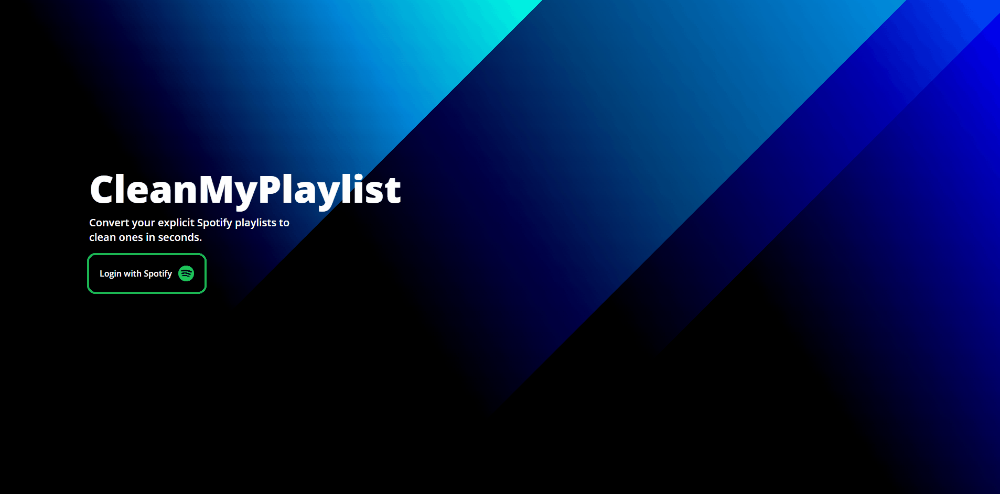

# CleanMyPlaylist

A web app to convert explicit songs in a Spotify playlist to their clean versions (if they exist)

## Technology Stack

 


### Client

* [React JS](https://reactjs.org)
* [Tailwind CSS](https://tailwindcss.com/docs/)
* [Bundled using Webpack](https://webpack.js.org/)

### Server
* [Express JS](https://expressjs.com/)
* [Passport JS for Authentication (Spotify Strategy)](http://www.passportjs.org/packages/passport-spotify/)

## Demo

[CleanMyPlaylist](https://cleanmyplaylist.onrender.com/)




## Run Locally

### Clone the project

```bash
  git clone https://github.com/aryanchopra/CleanMyPlaylist
```

### Go to the project directory

```bash
  cd CleanMyPlaylist
```


### Install dependencies


```bash
  npm install && cd client && npm install
```


### Environment Variables

To run this project, you will need to add the following environment variables to your .env file located in the root directory:
`CLIENT_ID`
`CLIENT_SECRET` 
`REDIRECT_URI`

### API Keys
You can get your API key by logging in to your Spotify account at https://developer.spotify.com/dashboard/ and creating a new application.


### Start the server

```bash
  npm run dev
```

### Start the client

```bash
  cd client && npm run dev
```
## Author

[](https://twitter.com/_aryanchopra_) 

[](https://www.linkedin.com/in/aryan-chopra-65008634/)

## License

[MIT License](https://github.com/aryanchopra/CleanMyPlaylist/blob/master/LICENSE) Copyright (c) 2021 Aryan Chopra

